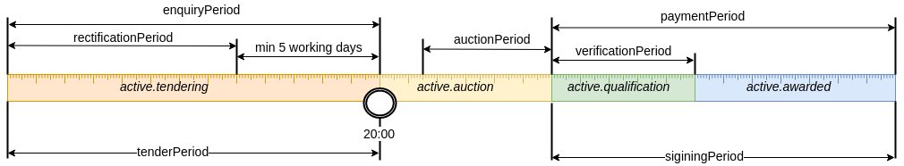

.. _procurementMT:

procurementMethodType: propertyLease
====================================

З метою проведення процедури здачі майна в оренду в межах системи `ProZorro.Sale CDB2` реалізовано новий `procurementMethodType: propertyLease`.

Нова процедура складається з наступних етапів: 

Для параметра `minNumberOfQualifiedBids: 2`:

Для параметра `minNumberOfQualifiedBids: 1`:

.. image:: _static/2.png
